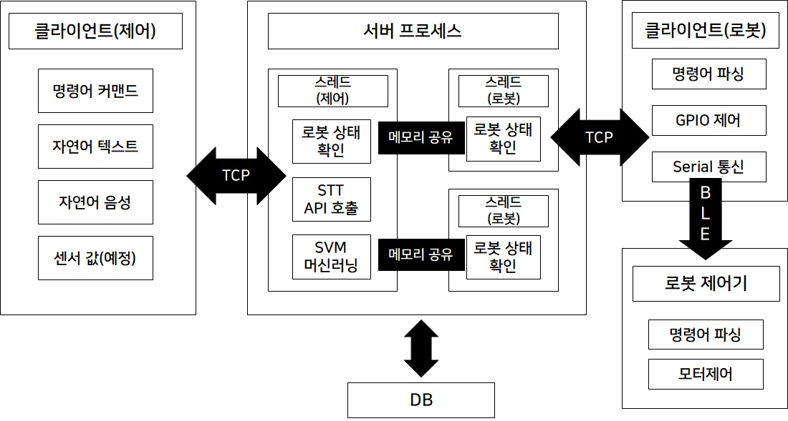
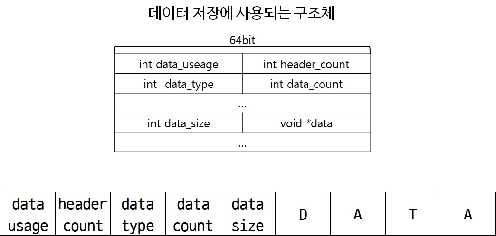

# Wedge Robot

다양한 메소드로 로봇을 제어를 보조해주는 서비스입니다. 음성인식과, 채팅시스템 혹은 RC 등 사용자가 원하는 방식으로 제어할 수 있도록 로봇과 컨트롤러를 중계해 주는 TCP기반의 플랫폼 입니다.

## 개발 목적

로봇마다 서로 다른 프로토콜을 사용하여 로봇을 제어하려 할 때마다 데이터시트를 찾는 일이 귀찮습니다. 그래서 만들어봤습니다.

## 개발 환경

- Server : Ubuntu(14.04 LTS)
- Client : Raspberry Pi(RASPBIAN), Windows 10
- Database : SQLite
- Language : C(server), Python(server, client)

## 파일 구조
- server
  - project_server.c : 멀티스레드 기반의 TCP소켓 서버 코드입니다.
  - protocol.c & protocol.h : TCP통신에 사용한 프로토콜을 정의한 코드입니다.
  - sqlite3.c & sqlite3.h : sqlite DB를 이용할 때 사용한 라이브러리입니다
  - STT
    - azureAPI.py : azure congnitive API를 호출하는데 사용한 코드입니다. OAuth토큰발행, 결과 호출, 낮은 확신도 데이터 제거 함수가 들어있습니다.
    - nlp.py : KoNLPy 라이브러리를 사용해 명사와 동사를 str형태로 리턴해주는 코드입니다.
    - svm.py : 미리 생성한 학습 모델을 호출하여 예측을 하는 코드입니다.
    - SVM-fit.ipynb : 학습데이터를 이용해 LinerSVC()를 GridSearchCV로 학습하고 모델을 생성하는 코드입니다.
    - main.py : c에서 popen으로 실행했을 때 음성 파일에 대한 예측 결과를 print해주는 통합 파일입니다.
- client
  - client(control).py : 컨트롤러(유저) 클라이언트 코드입니다. main문을 통해 콘솔로 이용 가능한 구조로 이루어져 있습니다.
  - client(robot).py : 로봇 클라이언트 코드입니다. argv를 통해 제어할 로봇을 함께 입력받습니다.
  - speech2file.py : 현재 기기(윈도우)에서 활성화된 마이크를 통해 음성을 녹음하여 wav파일로 만드는 코드입니다.

## 시스템 구조도

## TCP 프로토콜

1. data useage

    |  data useage 값  	|             용도            	|
    |:----------------:	|:---------------------------:	|
    |    0x80000000    	|     Controller에서 송신     	|
    |    0x40000000    	|      Server에서   송신      	|
    |    0x20000000    	|       Robot에서   송신      	|
    |    0x08000000    	|    Controller에서   수신    	|
    |    0x04000000    	|      Server에서   수신      	|
    |    0x02000000    	|       Robot에서   수신      	|
    |    0x00000001    	|          최초 연결          	|
    |    0x00000002    	|             종료            	|
    |    0x00000003    	|    연결   가능 로봇 목록    	|
    |    0x00000004    	|       로봇   연결 요청      	|
    |    0x00000005    	|         음성   명령         	|
    |    0x00000006    	|        모션   id명령        	|
    |    0x00000007    	|       로봇   연결 종료      	|

2. header count

    헤더의 수를 int형태로 나타냅니다

3. data type

    |    data type 값    	|             용도             	|
    |:------------------:	|:----------------------------:	|
    |     0x00000000     	|     int   형태의   데이터    	|
    |     0x00000001     	|    char   형태의   데이터    	|
    |     0x00000002     	|    string   형태의 데이터    	|
    |     0x00000003     	|       wav   파일(byte)       	|

4. data count
    데이터의 수를 int형태로 나타냅니다

5. data size
    데이터의 크기를 int형태로 나타냅니다

6. data
    데이터가 담기는 영역입니다

ex1) 로봇이 서버에 연결요청

|    data     usage    	|    header     count    	|    data     type    	|    data     count    	|    data1     size    	|    data1    	|    data2     size    	|    data2    	|
|:--------------------:	|:----------------------:	|---------------------	|----------------------	|-------------------------	|-------------	|-------------------------	|-------------	|
|    0x24000001    	|    1    	|    2    	|    2    	|    strlen     (name)    	|    name    	|    strlen     (type)    	|    type    	|

ex2) 조종기가 2번 로봇에 음성 명령

|    data     usage    	|    header     count    	|    data     type1    	|    data     count1    	|    data     type2    	|    data     count2    	|    data     size    	|    data    	|
|:--------------------:	|:----------------------:	|----------------------	|-----------------------	|----------------------	|-----------------------	|-------------------------	|------------	|
|    0x84000005    	|    2    	|    0    	|    1    	|    1    	|    3    	|    strlen     (name)    	|    name    	|